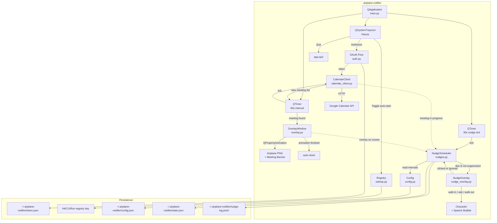

## Goal Capsule

**Objective:** Build a Windows desktop app that lives in the system tray and puts two kinds of animated character on screen:

1. **Meeting alert** -- stays continuously in sync with Google Calendar and flies an airplane across the screen carrying the meeting name whenever a meeting starts within 5 minutes.
2. **Ambient self-care nudges** -- on their own recurring schedule, a character walks in from the top-right corner, asks "Did you eat?" or "Did you drink water?", waits, and walks back out.

Both share one overlay technology, one tray icon, and one event loop. The nudges do not depend on Google Calendar, but they are suppressed while a meeting is in progress.

**Primary property:** the calendar connection is *automatic and continuous*. Anything added, moved, or deleted in Google Calendar -- from any device -- is reflected in the app without the user ever refreshing, reopening, or re-authorizing anything. This is the feature the product is judged on; everything else is decoration on top of it.

**Authority hierarchy:**
1. This plan (settled decisions override all else)
2. Research findings documented above
3. Repo conventions from sibling CLI packages (`youtube-py`, `instagram-py`, `reddit-py`)

**Stop conditions:**
- The app runs from the system tray, stays in sync with Google Calendar on a 30-second cycle, and shows the overlay for meetings starting in 5 minutes or less
- A meeting created on the user's phone is honoured by the desktop app within ~30 seconds, with no manual refresh anywhere in the product
- The eat/water nudge characters fire on their own timers, respect quiet rules, and log every appearance so the cadence can be reviewed and retuned
- All timings live in an editable config file that is re-read without restarting the app
- The app survives reboot via auto-start registry entry
- The app packages into a portable PyInstaller `--onedir` build

**Execution profile:** Single implementer, sequential unit execution, all code in `airplane-notifier/` subdirectory.

---

## Product Contract

### Summary

A lightweight Windows system tray app that puts friendly animated characters on the desktop for two purposes.

**Meetings.** It holds a live connection to Google Calendar and alerts the user with a playful full-screen animated airplane flyover showing the meeting name. The airplane crosses the screen left-to-right over ~5 seconds, then the overlay auto-dismisses. The sync is hands-off by design: add a meeting on your phone in the morning and the desktop app already knows about it, with no refresh button anywhere in the product.

**Self-care.** Independently of the calendar, a small character walks in from the top-right corner on a recurring schedule and asks a single question -- "Did you eat?" or "Did you drink water?" -- then walks back out. Clicking the character acknowledges it and resets its timer; ignoring it lets it leave and re-ask sooner. Every appearance is logged so the real-world cadence can be reviewed after a few days and the intervals retuned.

### Problem Frame

Calendar notifications are easy to miss or dismiss. A full-screen animated airplane is unmissable and fun -- it forces awareness of the next meeting without requiring the user to check any app. The app lives in the system tray and requires zero daily interaction.

### Requirements

**Authentication & Calendar Access**

R1. The app authenticates with Google Calendar using OAuth 2.0 via `InstalledAppFlow.run_local_server(port=8080)` with the `calendar.readonly` scope.

R2. OAuth tokens persist to `~/.airplane-notifier/token.json` and auto-reload on startup. The browser auth flow only triggers when the token is missing or expired and cannot be refreshed.

R3. The app bundles `credentials.json` (GCP OAuth client credentials) and resolves its path correctly both in development and in a PyInstaller frozen build via `sys._MEIPASS`.

**Calendar Sync (automatic, continuous, no manual refresh)**

R4. The app queries Google Calendar every 30 seconds for events starting within the next 2 hours. There is no manual refresh control anywhere in the product, by design.

R5. When an event starts within 5 minutes from now, the app triggers the overlay notification.

R6. Alert deduplication is keyed on the pair `(event_id, start_time)`, not on `event_id` alone, so a rescheduled meeting alerts again at its new time while an unchanged meeting never alerts twice.

R7. All-day events are excluded from notifications.

R31. Changes made in Google Calendar on any device -- create, edit, reschedule, delete, or decline -- are picked up automatically on the next sync cycle. The user-visible guarantee is "within about 30 seconds", never "instant", and the plan does not claim otherwise.

R32. A meeting that is deleted or cancelled before its alert fires must never produce an overlay. Because each cycle re-queries the live window rather than replaying a cached list, a removed event simply stops being returned.

R33. A meeting moved *further into the future* must not alert at its old time, and must alert at its new time. A meeting moved *closer* alerts as soon as it enters the 5-minute window.

R34. Sync failures (offline, DNS failure, HTTP 5xx, rate limiting) are logged and retried on the next cycle with exponential backoff capped at 5 minutes. Recovery is automatic and requires no user action; the backoff resets on the first success.

R35. A meeting created *inside* the 5-minute window (e.g. an ad-hoc call starting in 3 minutes) alerts on the next cycle rather than being skipped as "already started".

R36. The tray icon tooltip shows the time of the last successful sync, so it is visible at a glance that the connection is alive without opening anything.

**Overlay Notification**

R8. The overlay is a frameless, always-on-top, fully transparent full-screen PyQt6 window.

R9. An airplane PNG animates left-to-right across the full screen width over approximately 5 seconds.

R10. The meeting name (event summary) is displayed as a banner alongside/below the airplane.

R11. The overlay auto-dismisses when the animation completes. No user interaction required.

**System Tray**

R12. The app runs as a system tray icon with no visible main window.

R13. The tray context menu provides: "Authorize / Re-authorize", "Toggle auto-start at login", and "Quit".

R14. Closing the overlay does not quit the app (`setQuitOnLastWindowClosed(False)`).

**Auto-Start**

R15. The app can register/unregister itself in `HKCU\Software\Microsoft\Windows\CurrentVersion\Run` for auto-start at Windows login.

R16. The registry value uses `sys.executable` when running frozen (PyInstaller sets it to the `.exe`), and `"{sys.executable}" -m airplanenotifier` in development, so auto-start works correctly in both modes.

**Packaging**

R17. The app packages with PyInstaller `--onedir` to avoid SmartScreen false positives associated with `--onefile`.

R18. A `build.bat` script automates: create venv, pip install dependencies, run PyInstaller.

**Ambient Nudges**

R19. The app supports two nudge types, each with its own character, question text, and independent timer: `food` ("Did you eat?") and `water` ("Did you drink water?").

R20. A nudge animates as: character enters from a screen corner, walks left roughly 18% of the screen width over ~1.5s, stops, a speech bubble fades in with the question, holds ~4s, the bubble fades out, and the character walks back out to the right over ~1.5s. Total ~8s. The overlay closes when the exit animation finishes.

R20a. The entry corner is configurable via `nudge_corner` in `config.json`, accepting `bottom-right` (default), `top-right`, `bottom-left`, or `top-left`. For the two left-hand corners the walk direction mirrors: the character enters from the left edge, walks rightward, and exits left.

R20b. The default is `bottom-right`. A walking character needs a floor to walk on -- entering at the top of the screen reads as walking through mid-air. Bottom-right also keeps the character clear of window title bars and near the system tray, which is where the app already lives. `top-right` remains available because it overlaps less with taskbar notification popups.

R21. Each nudge type has its own interval, counted from the last time that nudge was *resolved* (acknowledged or expired). Defaults: `water` every 45 minutes, `food` every 180 minutes.

R22. Nudges only fire inside a configurable active-hours window. Default: 09:00-23:00 local time. Outside the window, timers are held, not queued -- there is no backlog burst at 09:00.

R23. Nudges are suppressed while a Google Calendar event is currently in progress, and for 60 seconds after any meeting overlay finishes. A suppressed nudge is retried on the next tick, not dropped.

R24. Nudges are suppressed while the workstation is locked, or while the user has been idle for more than 10 minutes. Idle time is measured from the last keyboard/mouse input.

R25. Clicking the character acknowledges the nudge: the overlay closes immediately and that timer resets to its full interval. Ignoring the nudge (letting it walk off) schedules a re-ask after a shorter backoff -- default 15 minutes -- up to 3 consecutive times, after which the timer resets to its full interval regardless.

R26. All nudge timings (intervals, backoff, active hours, hold durations, idle threshold, enable/disable per type) live in `~/.airplane-notifier/config.json`. The file is re-read on every tick, so edits take effect within one tick without restarting the app. A missing or unparseable config is replaced with a documented default.

R27. Nudge timer state (next-due timestamp and consecutive-ignore count per type) persists to `~/.airplane-notifier/state.json` so that restarting the app does not reset the cadence or cause an immediate nudge burst.

R28. Every nudge appearance is appended as one JSON line to `~/.airplane-notifier/nudge-log.jsonl` recording timestamp, type, and outcome (`acknowledged` / `ignored`). This is the raw data for reviewing how frequent the nudges actually feel and retuning R21.

R29. The nudge overlay is click-through everywhere except the character's own bounding box, so it never steals a click from the window underneath.

R30. Only one overlay of any kind is on screen at a time. A meeting overlay always wins; a nudge that would collide is deferred to the next tick.

### Scope Boundaries

**In scope:**
- Google Calendar only (no Outlook, no Apple Calendar, no other providers)
- The user's `primary` calendar only -- not secondary or subscribed calendars
- Single user, single Google account
- Windows only
- Notification overlay only -- no meeting join, no RSVP, no calendar editing
- Exactly two nudge types (eat, drink water), which the user can disable per type but not extend from the UI
- A one-line-per-nudge log file, reviewed by hand -- no in-app stats screen or charts

**Out of scope:**
- Multi-user or multi-account support
- Mobile or macOS/Linux builds
- Integration with video conferencing (Zoom, Meet, Teams join links)
- Google push notifications / `watch` channels (see KTD16 -- not available to a desktop app)
- Sub-30-second or true real-time calendar propagation
- Persistent history of *meeting* notifications
- Sound effects or audio alerts
- Configurable meeting lead time (still hardcoded at 5 minutes)
- A settings GUI -- nudge tuning is done by editing `config.json` by hand
- Any health tracking beyond "was the question shown, was it clicked" -- no intake totals, no goals, no streaks
- Nudges reacting to anything other than the clock (no webcam, no activity classification)

---

## Planning Contract

### Key Technical Decisions

KTD1. **PyQt6 over Tkinter for the overlay.** Tkinter cannot produce a truly transparent frameless overlay with smooth animation. PyQt6 provides `WA_TranslucentBackground`, `WindowStaysOnTopHint`, and `QPropertyAnimation` natively. Research confirms these flags work on Windows 11.

KTD2. **QSystemTrayIcon over pystray.** pystray runs its own event loop, which conflicts with the Qt event loop. `QSystemTrayIcon` is built into PyQt6 and shares the same `QApplication` loop. Research confirms the two-event-loop conflict is a known issue.

KTD3. **InstalledAppFlow.run_local_server() over OOB flow.** Google fully blocked the OOB OAuth flow in January 2023. The localhost redirect on port 8080 is the only supported flow for installed apps. The GCP OAuth client must have `http://localhost:8080/` as an authorized redirect URI.

KTD4. **Token persistence via google.oauth2.credentials JSON serialization.** Using `creds.to_json()` / `Credentials.from_authorized_user_file()` rather than pickle. JSON is inspectable and avoids pickle security concerns. Token stored at `~/.airplane-notifier/token.json`.

KTD5. **PyInstaller --onedir over --onefile.** `--onefile` extracts to a temp directory on every launch and is flagged by Windows SmartScreen as suspicious. `--onedir` produces a stable folder with a visible `.exe` and DLLs, which SmartScreen handles better. Research confirms this is the standard mitigation.

KTD6. **QTimer-based polling over background threads.** A `QTimer` firing every 60 seconds keeps all logic on the Qt main thread, avoiding cross-thread signal issues. Calendar API calls are fast (single HTTP request) and won't block the UI noticeably.

KTD7. **In-memory deduplication set over persistent storage.** Tracking alerted event IDs in a Python `set()` that resets on app restart. This means a meeting could re-alert if the app restarts within the 5-minute window, but this is acceptable -- better to over-notify than miss a meeting.

KTD8. **Fresh pip venv for builds, not Anaconda.** Anaconda bundles extra DLLs that PyInstaller pulls in unnecessarily, inflating the build and causing import errors. A clean `python -m venv` + `pip install` produces a minimal, predictable dependency tree.

KTD9. **A separate `NudgeOverlay` class, not a reuse of `OverlayWindow`.** The two overlays differ in entry geometry (corner vs full-width traverse), lifecycle (multi-phase walk/hold/walk vs single traverse), and hit-testing (the nudge needs a clickable region; the plane is fully click-through). Forcing one class to serve both produces a flag-driven mess. They share only the transparent-fullscreen window setup, factored into a small `_TransparentFullScreenWindow` base.

KTD10. **Nudge cadence is driven by persisted wall-clock deadlines, not in-process countdowns.** Each type stores a `next_due` ISO timestamp in `state.json`, and the tick handler compares `now` against it. This survives app restarts, sleep, and hibernate -- an in-process `QTimer` countdown would silently reset on every restart and drift across sleep.

KTD11. **Config is re-read every tick rather than watched with a filesystem watcher.** A `QFileSystemWatcher` adds a moving part for no real benefit; re-reading a small JSON file every 30 seconds is free, and one tick of latency is imperceptible when tuning intervals by hand.

KTD12. **Idle and lock detection via `ctypes` against `user32`, not a new dependency.** `GetLastInputInfo` gives idle milliseconds and a failing `OpenInputDesktop` indicates a locked workstation. Both are a few lines of `ctypes` and avoid pulling in `pywin32` purely for this.

KTD13. **A dedicated 30-second nudge tick, separate from the calendar sync cycle.** Keeping them separate means nudge responsiveness is not coupled to network latency or calendar failures, and the nudge tick stays pure local computation with no I/O beyond two small file reads.

KTD14. **Walk animation via a vertical bob on a single PNG for v1, with an optional frame sequence later.** A sprite sheet needs authored frames; a single character PNG translated horizontally with a ~6px sine bob and slight rotation reads convincingly as walking at this size. The overlay accepts either -- if `walker_food/` is a directory of numbered frames it cycles them, otherwise it bobs the single PNG.

KTD15. **Bounded-window polling every 30 seconds, not `syncToken` incremental sync.** This is the decision that delivers the product's primary property, so it is spelled out. `events.list` rejects `syncToken` in combination with `timeMin`/`timeMax`/`orderBy`; using it would return changes across the *entire* calendar and force the app to maintain its own local event cache just to answer "what starts in the next 5 minutes". A 30-second query bounded to `now .. now+2h` is a single small request that is trivially correct for creates, edits, reschedules, and deletions -- a deleted event simply stops being returned, with no cache to invalidate. At roughly 2,880 requests/day it sits far inside the Calendar API's per-project quota.

KTD16. **No Google push notifications.** Google's `events.watch` channels deliver change notifications by POSTing to a publicly reachable HTTPS endpoint. A desktop app behind NAT has no such endpoint, and standing up a tunnel or relay server is wildly out of proportion for a personal tray app. Thirty-second polling is the correct desktop-side equivalent. The consequence is stated honestly in R31: the guarantee is "within about 30 seconds", not "instant".

KTD18. **Nudge entry corner is configuration, not a constant.** Which corner reads best depends on screen size, taskbar position, and where the user keeps their working window -- none of which the plan can settle in advance. Since `config.json` already exists and hot-reloads (R26), exposing the corner costs one key and one lookup, and lets the choice be made by trying it rather than by arguing about it. The default is `bottom-right` on the physical-plausibility grounds in R20b.

KTD17. **Dedup key is `(event_id, start_time)`, not `event_id`.** Keying on the ID alone means a meeting that gets rescheduled after its first alert can never alert again -- exactly the case where the user most needs the reminder. Including the start time makes a reschedule look like a new alertable occurrence, which is the desired behaviour, at the cost of one extra alert if a meeting is nudged by a minute inside its own window.

### High-Level Technical Design



### Implementation Constraints

1. All file I/O paths must use `pathlib.Path` for cross-compatibility within Windows.
2. `credentials.json` resolution must check `sys._MEIPASS` first (frozen), then fall back to the package directory (development).
3. The config directory `~/.airplane-notifier/` must be created with `mkdir(parents=True, exist_ok=True)` on first use.
4. UTF-8 stdout safety: wrap `sys.stdout` with `make_stdout_safe()` following the repo pattern, to prevent `UnicodeEncodeError` on Windows console.
5. `os.chmod` calls must be wrapped in `try/except OSError` per the repo's Windows-explicit pattern.
6. The app must not crash if Google Calendar is unreachable -- sync failures are logged and retried on the next cycle with backoff (R34).
7. Nudge scheduling must never touch the network or block the Qt main thread -- it is pure local computation over two small JSON files.
8. A corrupt `config.json` or `state.json` must never prevent startup: parse failures fall back to defaults and rewrite the file.
9. All timestamps written to `state.json` and `nudge-log.jsonl` are timezone-aware ISO 8601 in local time, so the log stays readable by hand.
10. No code path may present a manual "refresh calendar" affordance -- the sync is the product (R31).

---

## Output Structure

```
airplane-notifier/
    pyproject.toml
    build.bat
    airplane-notifier.spec
    credentials.json              # GCP OAuth client (user-supplied, gitignored)
    assets/
        airplane.png              # ~100-200px wide airplane image (see open question)
        tray_icon.png             # 32x32px icon for the system tray
        walker_food.png           # character for "Did you eat?"          (~180-260px tall)
        walker_water.png          # character for "Did you drink water?"  (~180-260px tall)
    airplanenotifier/
        __init__.py
        __main__.py               # entry point: python -m airplanenotifier
        main.py                   # QApplication setup, sync cycle + nudge tick timers
        auth.py                   # OAuth flow, token load/save, credentials.json resolution
        calendar_client.py        # Google Calendar sync, event filtering, dedup, backoff
        overlay.py                # Transparent full-screen overlay, airplane animation
        nudge_overlay.py          # Walk-in character overlay, speech bubble, click target
        nudges.py                 # Nudge scheduler: due-checks, suppression, state, logging
        config.py                 # config.json load/save/defaults, state.json persistence
        idle.py                   # ctypes idle-time and workstation-lock detection
        tray.py                   # QSystemTrayIcon, context menu, last-sync tooltip
        startup.py                # Windows registry auto-start read/write/delete
```

**Runtime files created in `~/.airplane-notifier/`:**

```
token.json          # OAuth credentials (U2)
config.json         # user-editable timings; re-read every tick
state.json          # next_due + consecutive-ignore count per nudge type
nudge-log.jsonl     # one line per nudge appearance, for cadence review
```

**Open question -- airplane image:** The implementer must source or create an airplane PNG (approximately 100-200px wide, transparent background) and place it at `airplane-notifier/assets/airplane.png`. A simple silhouette works. This is not generated by the build process.

---

## Implementation Units

### U1. Project scaffold

**Goal:** Create the `airplane-notifier/` directory structure, `pyproject.toml`, empty package files, asset placeholder, and `.gitignore` entry.

**Requirements:** Foundation for all other units.

**Dependencies:** None.

**Files:**
- `airplane-notifier/pyproject.toml`
- `airplane-notifier/airplanenotifier/__init__.py`
- `airplane-notifier/airplanenotifier/__main__.py` (stub)
- `airplane-notifier/assets/airplane.png` (placeholder -- 1x1 transparent PNG or a simple airplane silhouette)
- `.gitignore` (append `airplane-notifier/` entry)

**Approach:**
- Follow the repo convention from `youtube-py/pyproject.toml`: `setuptools>=68`, `requires-python>=3.9`.
- Dependencies: `PyQt6>=6.6`, `google-api-python-client>=2.100`, `google-auth-oauthlib>=1.2`, `google-auth-httplib2>=0.2`.
- Entry point in `[project.scripts]`: `airplane-notifier = "airplanenotifier.main:main"`.
- `__main__.py` contains `from airplanenotifier.main import main; main()` so `python -m airplanenotifier` works.
- `__init__.py` is empty.
- Add the following entries to the root `.gitignore` (source is tracked; only build artifacts and secrets are excluded):
  ```
  airplane-notifier/dist/
  airplane-notifier/build_venv/
  airplane-notifier/credentials.json
  ```

**Test scenarios:**
1. `pip install -e airplane-notifier/` in a fresh venv completes without errors.
2. `python -m airplanenotifier` from the venv invokes `main()` (which can be a no-op stub at this stage).
3. `git status` shows `airplane-notifier/` source files as trackable; only `dist/`, `build_venv/`, and `credentials.json` within it are gitignored.
4. `pyproject.toml` lists all four dependencies with correct version constraints.

**Verification:** The package installs editably and the entry point resolves. The directory is excluded from git tracking.

---

### U2. Google Calendar OAuth + token persistence

**Goal:** Implement OAuth 2.0 authentication with Google Calendar, persisting tokens to disk so the user only needs to authorize once.

**Requirements:** R1, R2, R3.

**Dependencies:** U1.

**Files:**
- `airplane-notifier/airplanenotifier/auth.py`

**Approach:**
- `get_credentials_path()`: check `getattr(sys, '_MEIPASS', None)` first; if set, return `Path(sys._MEIPASS) / 'credentials.json'`. Otherwise, return `Path(__file__).parent.parent / 'credentials.json'`.
- `CONFIG_DIR = Path.home() / '.airplane-notifier'` -- created with `mkdir(parents=True, exist_ok=True)`.
- `TOKEN_PATH = CONFIG_DIR / 'token.json'`.
- `get_credentials() -> google.oauth2.credentials.Credentials`:
  1. If `TOKEN_PATH` exists, load with `Credentials.from_authorized_user_file(TOKEN_PATH, SCOPES)`.
  2. If loaded creds are expired but have a refresh token, call `creds.refresh(Request())`.
  3. If no valid creds, run `InstalledAppFlow.from_client_secrets_file(get_credentials_path(), SCOPES).run_local_server(port=8080)`.
  4. Save creds to `TOKEN_PATH` via `TOKEN_PATH.write_text(creds.to_json())`.
  5. Return creds.
- `SCOPES = ['https://www.googleapis.com/auth/calendar.readonly']`.
- `clear_credentials()`: delete `TOKEN_PATH` if it exists. Called by tray "Re-authorize" action.

**Test scenarios:**
1. **First run, no token file:** `get_credentials()` launches the local server flow, user completes browser consent, token is saved to `~/.airplane-notifier/token.json`, and valid credentials are returned.
2. **Subsequent run, valid token exists:** `get_credentials()` loads from file, no browser opens, credentials are returned immediately.
3. **Token expired but refresh token present:** `get_credentials()` calls `creds.refresh()`, saves the refreshed token, returns valid credentials without opening a browser.
4. **Token expired, no refresh token:** `get_credentials()` falls through to `run_local_server()` and re-authorizes.
5. **`credentials.json` missing:** `get_credentials()` raises `FileNotFoundError`. The caller (main.py) catches this and shows a tray notification explaining the missing file.
6. **Frozen build:** `get_credentials_path()` returns `sys._MEIPASS / credentials.json` when running from PyInstaller.
7. **`clear_credentials()` called:** `token.json` is deleted; next `get_credentials()` call triggers the browser flow.

**Verification:** After running the auth flow once, `~/.airplane-notifier/token.json` exists and contains a valid JSON object with `token`, `refresh_token`, `client_id`, and `client_secret` fields. Restarting the app does not trigger the browser flow.

---

### U3. Calendar sync service

**Goal:** Keep continuously in sync with Google Calendar and identify which events start within 5 minutes, deduplicating to avoid repeat alerts while still honouring reschedules. This unit carries the product's primary property (R31) -- review it against the sync requirements, not just the polling ones.

**Requirements:** R4, R5, R6, R7, R31, R32, R33, R34, R35, R36.

**Dependencies:** U2.

**Files:**
- `airplane-notifier/airplanenotifier/calendar_client.py`

**Approach:**
- `CalendarClient` class:
  - `__init__(self, credentials)`: build the service via `build('calendar', 'v3', credentials=credentials)`. Initialize `self._alerted: set[tuple[str, str]] = set()` -- keyed on `(event_id, start_time_iso)` per KTD17, so a rescheduled meeting alerts again at its new time. Initialize `self._backoff_until: datetime | None = None` and `self._consecutive_failures = 0` for R34.
  - Every call first checks `self._backoff_until`; if it is in the future, return `[]` immediately without touching the network.
  - `get_upcoming_meetings(self) -> list[dict]`:
    1. Compute `now` as UTC ISO string, `two_hours_later` as UTC ISO string.
    2. Call `service.events().list(calendarId='primary', timeMin=now, timeMax=two_hours_later, singleEvents=True, orderBy='startTime').execute()`.
    3. Filter out all-day events (events where `start` has a `date` key instead of `dateTime`).
    4. Filter to events where `0 <= (event_start - now).total_seconds() <= 300` — i.e., starting within the next 5 minutes and not yet started. This bounds both ends: prevents re-alerting events that started long ago on app restart, and avoids a future-only comparison that misses the window when `now` is inside the event start.
    5. Filter out events whose `(id, start_time)` pair is already in `self._alerted`.
    6. Add the remaining pairs to `self._alerted`.
    7. Return list of dicts with `id`, `summary`, `start_time` for each matching event.
    8. On success, reset `self._consecutive_failures = 0` and `self._backoff_until = None`, and record `self._last_sync = now` for the tray tooltip (R36).
  - `reset_alerts(self)`: clear `self._alerted`. (Not used in normal flow, but useful for testing.)
  - `is_meeting_in_progress(self) -> bool`: returns `True` if any event from the last successful sync has `start <= now <= end`. Used by the nudge scheduler for suppression (R23). Reads the cached result of the last sync -- it never issues its own request.
  - `last_sync_time(self) -> datetime | None`: for the tray tooltip (R36).
- **Deletions and reschedules need no special handling.** Each cycle re-queries the live `now .. now+2h` window (KTD15), so a deleted event simply stops being returned (R32) and a moved event arrives with a new `start_time` (R33). There is no cached list to invalidate.
- All exceptions from the API call are caught and logged to stderr; an empty list is returned on failure. On failure, increment `self._consecutive_failures` and set `self._backoff_until = now + min(30s * 2**failures, 5min)` per R34.

**Test scenarios:**
1. **No events in next 2 hours:** `get_upcoming_meetings()` returns an empty list.
2. **Event starts in 3 minutes:** event is returned with its summary and start time.
3. **Event starts in 10 minutes:** event is not returned (outside the 5-minute window).
4. **Event starts in 3 minutes, polled again:** second call returns empty list because the `(id, start_time)` pair is in `_alerted`.
4b. **Event alerted, then rescheduled to 4 minutes later:** the new `(id, start_time)` pair is absent from `_alerted`, so it alerts again at the new time (R33).
4c. **Event alerted, then deleted:** subsequent syncs do not return it and no overlay fires (R32).
4d. **Event created on a phone 3 minutes before it starts:** the next sync cycle returns it and it alerts (R31, R35).
4e. **Network down for 4 minutes:** each failure grows the backoff (30s, 60s, 120s, 240s, capped 300s); no crash; the first success resets the backoff to zero (R34).
5. **All-day event today:** event is excluded regardless of timing.
6. **Multiple events, one at 2 min and one at 4 min:** both are returned on first poll.
7. **API call fails (network error):** returns empty list, does not crash, error is logged.
8. **Event with no summary field:** `summary` defaults to `"(No title)"`.

**Verification:** Given a calendar with a known test event starting in 4 minutes, `get_upcoming_meetings()` returns exactly that event on the first call and an empty list on the second call.

---

### U4. Transparent overlay window + airplane animation

**Goal:** Display a full-screen transparent overlay with an airplane PNG animating left-to-right and a meeting name banner, auto-dismissing after ~5 seconds.

**Requirements:** R8, R9, R10, R11.

**Dependencies:** U1.

**Files:**
- `airplane-notifier/airplanenotifier/overlay.py`

**Approach:**
- `OverlayWindow(QWidget)`:
  - `__init__(self, meeting_name: str, airplane_image_path: str)`:
    - Set window flags: `Qt.WindowType.FramelessWindowHint | Qt.WindowType.WindowStaysOnTopHint | Qt.WindowType.Tool`.
    - `setAttribute(Qt.WidgetAttribute.WA_TranslucentBackground)`.
    - `setAttribute(Qt.WidgetAttribute.WA_TransparentForMouseEvents)` — set unconditionally so the overlay never captures clicks or keyboard focus; `WA_TranslucentBackground` alone does not achieve click-through.
    - `showFullScreen()`.
    - Load airplane PNG as `QPixmap`.
    - Create a `QLabel` for the airplane image, positioned at `(0, screen_height // 2 - airplane_height // 2)`.
    - Create a `QLabel` for the meeting name, styled with large white text, dark semi-transparent background, positioned below the airplane.
    - Set up `QPropertyAnimation` on the airplane label's `pos` property:
      - Start: `QPoint(-airplane_width, y_center)`
      - End: `QPoint(screen_width, y_center)`
      - Duration: 5000ms
      - Easing: `QEasingCurve.Type.Linear`
    - Connect `animation.finished` to `self.close`.
    - The meeting name label moves with the airplane (either animated in sync or stays centered).
  - `paintEvent`: fill with fully transparent color (no-op since `WA_TranslucentBackground` handles this).
  - `show_notification(self)`: start the animation.
- Airplane image path resolution: check `assets/airplane.png` relative to the package directory, with `sys._MEIPASS` fallback.

**Test scenarios:**
1. **Normal trigger:** overlay appears full-screen, airplane animates left-to-right across the screen, meeting name "Team Standup" is visible, overlay closes after ~5 seconds.
2. **Long meeting name:** text like "Q3 Planning Review with Engineering and Product Teams" renders without clipping (text wraps or truncates with ellipsis).
3. **Overlay does not block input:** since `WA_TranslucentBackground` is set, clicks pass through the transparent regions. If full click-through is needed, `WA_TransparentForMouseEvents` can be added.
4. **Multiple monitors:** `showFullScreen()` uses the primary monitor. This is acceptable for v1.
5. **Airplane image missing:** overlay shows the meeting name banner only, logs a warning. Does not crash.
6. **Two overlays triggered rapidly:** second overlay waits for the first to close, or replaces it. No overlapping animations.

**Verification:** Calling `OverlayWindow("Team Standup", "assets/airplane.png").show_notification()` produces a visible full-screen animation that auto-closes. The window does not appear in the taskbar (due to `Tool` flag).

---

### U5. System tray

**Goal:** Provide a persistent system tray icon with a context menu for authorization, auto-start toggle, and quitting.

**Requirements:** R12, R13, R14.

**Dependencies:** U1.

**Files:**
- `airplane-notifier/airplanenotifier/tray.py`

**Approach:**
- `TrayManager` class:
  - `__init__(self, app: QApplication, on_authorize: Callable, on_toggle_startup: Callable)`:
    - `app.setQuitOnLastWindowClosed(False)` -- CRITICAL: prevents overlay close from killing the app.
    - Create `QSystemTrayIcon` with a dedicated `assets/tray_icon.png` (32×32 px, not the full airplane PNG — scaling a 200px image to 16px produces a blurry tray icon).
    - Build `QMenu`:
      - "Authorize / Re-authorize" action -> calls `on_authorize`.
      - "Auto-start at login" action -> checkable, checked state read from registry on init, toggle calls `on_toggle_startup`.
      - Separator.
      - "Quit" action -> calls `app.quit`.
    - `tray_icon.setContextMenu(menu)`.
    - `tray_icon.show()`.
  - `show_message(self, title: str, message: str)`: wrapper around `tray_icon.showMessage()` for balloon notifications.
  - `update_autostart_checked(self, enabled: bool)`: update the checkable menu item state.

**Test scenarios:**
1. **App starts:** tray icon appears in the Windows system tray with the airplane icon.
2. **Right-click tray icon:** context menu shows three items: "Authorize / Re-authorize", "Auto-start at login" (with checkbox), "Quit".
3. **Click "Quit":** app exits cleanly, tray icon disappears.
4. **Click "Authorize / Re-authorize":** triggers the OAuth flow callback.
5. **Toggle "Auto-start at login":** checkbox state toggles, callback is invoked.
6. **Overlay opens and closes:** tray icon remains, app keeps running (verifies `setQuitOnLastWindowClosed(False)`).
7. **No airplane.png available:** tray icon uses a default Qt icon or a colored square as fallback.

**Verification:** The tray icon is visible and all three menu actions trigger their respective callbacks. Closing an overlay window does not terminate the app.

---

### U6. Main entry point + Qt polling loop

**Goal:** Wire all components together: start the Qt app, authenticate, set up the polling timer, and trigger overlays for new meetings.

**Requirements:** R4, R5, R14.

**Dependencies:** U2, U3, U4, U5.

**Files:**
- `airplane-notifier/airplanenotifier/main.py`
- `airplane-notifier/airplanenotifier/__main__.py`

**Approach:**
- `main()` function in `main.py`:
  1. `make_stdout_safe()` -- repo pattern for Windows UTF-8 safety.
  2. Create `QApplication(sys.argv)`.
  3. Resolve `airplane.png` path (check `sys._MEIPASS`, then package-relative `assets/`).
  4. Try `auth.get_credentials()`. If `FileNotFoundError` (missing `credentials.json`), show a tray balloon explaining the issue and continue without polling.
  5. If credentials obtained, create `CalendarClient(credentials)`.
  6. Create `TrayManager(app, on_authorize=..., on_toggle_startup=...)`.
  7. Set up the calendar sync `QTimer` with a 30000ms interval (R4), and a second, independent `QTimer` with a 30000ms interval for the nudge tick (KTD13).
  8. Connect timer `timeout` signal to `poll_calendar()`:
     - Call `calendar_client.get_upcoming_meetings()`.
     - For each returned meeting, create and show an `OverlayWindow(meeting['summary'], airplane_path)`.
     - If multiple meetings are returned, queue them and show them sequentially. Only mark a meeting as alerted once its overlay has actually been shown -- marking all of them on the first tick permanently drops every meeting after the first (see Doc Review note 6).
     - Set a module-level `overlay_active` flag while any overlay is on screen, cleared on close. The nudge scheduler reads it for R30.
  8b. Connect the nudge timer `timeout` signal to `nudge_scheduler.tick()` (U10).
  9. Fire one immediate poll on startup.
  10. `sys.exit(app.exec())`.
- `on_authorize` callback: call `auth.clear_credentials()`, then `auth.get_credentials()`, then reinitialize `CalendarClient`.
- `on_toggle_startup` callback: call `startup.toggle_autostart()`, update tray checkbox.
- `__main__.py`: `from airplanenotifier.main import main; main()`.

**Test scenarios:**
1. **Normal startup with valid token:** app starts, tray icon appears, first poll fires immediately, timer continues every 60 seconds.
2. **First startup, no token:** browser opens for OAuth, after consent the poll starts.
3. **credentials.json missing:** app starts, tray icon appears, balloon notification explains the missing file, no polling occurs, "Authorize" menu item is available.
4. **Poll returns a meeting:** overlay appears with the meeting name, airplane animates, overlay closes.
5. **Poll returns no meetings:** nothing happens, timer continues.
6. **Network error during poll:** error logged, no crash, timer continues.
7. **User clicks "Re-authorize":** old token cleared, browser opens, new token saved, polling resumes with new credentials.
8. **User clicks "Quit":** app exits, timer stops, tray icon disappears.

**Verification:** The app starts as a tray-only application, polls Google Calendar on a 60-second cycle, and shows an airplane overlay for meetings starting within 5 minutes.

---

### U7. Auto-start registry integration

**Goal:** Read, write, and delete the Windows registry key that starts the app at login.

**Requirements:** R15, R16.

**Dependencies:** U1.

**Files:**
- `airplane-notifier/airplanenotifier/startup.py`

**Approach:**
- `REGISTRY_KEY = r'Software\Microsoft\Windows\CurrentVersion\Run'`
- `APP_NAME = 'AirplaneNotifier'`
- `is_autostart_enabled() -> bool`:
  - Open `HKCU\...\Run` with `winreg.OpenKey`, try `winreg.QueryValueEx(key, APP_NAME)`.
  - Return `True` if value exists, `False` if `FileNotFoundError`.
- `enable_autostart()`:
  - Resolve the launch command:
    ```python
    if getattr(sys, 'frozen', False):
        exe_path = sys.executable          # PyInstaller: points to airplane-notifier.exe
    else:
        exe_path = f'"{sys.executable}" -m airplanenotifier'  # dev: python.exe + module
    ```
  - `winreg.SetValueEx(key, APP_NAME, 0, winreg.REG_SZ, exe_path)`.
- `disable_autostart()`:
  - `winreg.DeleteValue(key, APP_NAME)`. Catch `FileNotFoundError` silently.
- `toggle_autostart() -> bool`:
  - If enabled, disable. If disabled, enable. Return new state.
- All `winreg` calls wrapped in `try/except OSError` per repo conventions.

**Test scenarios:**
1. **No registry key exists:** `is_autostart_enabled()` returns `False`.
2. **Call `enable_autostart()`:** registry key is created with `sys.executable` as value. `is_autostart_enabled()` returns `True`.
3. **Call `disable_autostart()`:** registry key is deleted. `is_autostart_enabled()` returns `False`.
4. **Call `disable_autostart()` when no key exists:** no error raised.
5. **Call `toggle_autostart()` from disabled state:** returns `True`, key now exists.
6. **Call `toggle_autostart()` from enabled state:** returns `False`, key now deleted.
7. **Verify registry value matches `sys.executable`:** the stored path points to the actual running executable.

**Verification:** After `enable_autostart()`, the registry key `HKCU\Software\Microsoft\Windows\CurrentVersion\Run\AirplaneNotifier` exists and contains the correct executable path. After `disable_autostart()`, the key is gone.

---

### U8. Nudge configuration + state persistence

**Goal:** Provide the editable config file that drives nudge timing, and the state file that keeps cadence across restarts.

**Requirements:** R26, R27.

**Dependencies:** U1.

**Files:**
- `airplane-notifier/airplanenotifier/config.py`

**Approach:**
- `CONFIG_PATH = CONFIG_DIR / 'config.json'`, `STATE_PATH = CONFIG_DIR / 'state.json'` (reusing `CONFIG_DIR` from `auth.py`).
- `DEFAULT_CONFIG` dict, written verbatim on first run:
  ```json
  {
    "active_hours": {"start": "09:00", "end": "23:00"},
    "idle_suppress_minutes": 10,
    "nudge_corner": "bottom-right",
    "nudges": {
      "water": {"enabled": true, "interval_minutes": 45, "question": "Did you drink water?"},
      "food":  {"enabled": true, "interval_minutes": 180, "question": "Did you eat?"}
    },
    "ignore_backoff_minutes": 15,
    "max_consecutive_reasks": 3,
    "hold_seconds": 4
  }
  ```
- `load_config() -> dict`: read and parse `CONFIG_PATH`. On `FileNotFoundError`, write `DEFAULT_CONFIG` and return it. On `JSONDecodeError`, log a warning, rename the bad file to `config.json.bad`, write defaults, and return them (constraint 8). Shallow-merge over `DEFAULT_CONFIG` so a config missing new keys still works after an upgrade.
- `load_state() -> dict` / `save_state(state)`: same defensive pattern. State shape:
  ```json
  {"water": {"next_due": "2026-08-18T14:05:00+01:00", "consecutive_ignores": 0},
   "food":  {"next_due": "2026-08-18T16:30:00+01:00", "consecutive_ignores": 1}}
  ```
- `save_state` writes to a temp file in the same directory then `os.replace()` onto the target, so a crash mid-write cannot corrupt state.
- `append_nudge_log(entry: dict)`: append one JSON line to `nudge-log.jsonl` with `timestamp`, `type`, `outcome`. Open in append mode with `encoding='utf-8'`; swallow `OSError` (a failed log write must never break a nudge).

**Test scenarios:**
1. **First run, no config:** `load_config()` creates `config.json` with defaults and returns them.
2. **Hand-edited config:** changing `water.interval_minutes` to 5 is picked up on the next `load_config()` call with no restart.
3. **Corrupt config:** a file containing `{{{` is renamed to `config.json.bad`, defaults are rewritten, app continues.
4. **Config missing a newly added key:** merge over defaults supplies the missing key without error.
5. **State round-trip:** `save_state()` then `load_state()` returns an equal dict with timezone-aware timestamps preserved.
6. **Crash-safe write:** killing the process during `save_state()` leaves either the old valid file or the new one, never a truncated file.
7. **Log append:** three nudges produce exactly three lines in `nudge-log.jsonl`, each valid JSON.
8. **Read-only config dir:** `append_nudge_log()` swallows the `OSError` and the nudge still displays.
9. **`nudge_corner` set to an invalid value** (e.g. `"middle"`): falls back to `bottom-right` with a logged warning rather than raising.

**Verification:** Editing `config.json` by hand changes nudge cadence within one tick without restarting. `state.json` survives an app restart with `next_due` intact.

---

### U9. Walk-in nudge overlay + character animation

**Goal:** Display the character that walks in from the top-right, asks its question in a speech bubble, and walks back out -- clickable to acknowledge.

**Requirements:** R20, R25, R29.

**Dependencies:** U1.

**Files:**
- `airplane-notifier/airplanenotifier/nudge_overlay.py`

**Approach:**
- Factor the shared window setup out of `overlay.py` into `_TransparentFullScreenWindow` (frameless, always-on-top, `Tool`, `WA_TranslucentBackground`, `showFullScreen()`), per KTD9. `OverlayWindow` and `NudgeOverlay` both inherit it.
- `NudgeOverlay(_TransparentFullScreenWindow)`:
  - `__init__(self, question: str, character_path: str, hold_seconds: int)`.
  - Do **not** set `WA_TransparentForMouseEvents` on the window. Instead override `mousePressEvent`: if the click falls inside the character label's geometry, emit `acknowledged` and close; otherwise ignore the event so it falls through (R29). Note this is a genuine behavioural difference from the plane overlay, which is click-through everywhere.
  - Character position derives from `nudge_corner` (R20a), resolved once in `__init__`:
    - Vertical: `bottom-*` -> `y = screen_height - character_height - (screen_height * 0.04)`, so the character's feet sit just above the taskbar. `top-*` -> `y = screen_height * 0.08`.
    - Horizontal: `*-right` -> starts at `x = screen_width` (just off-screen right), walks to `screen_width - (screen_width * 0.18)`. `*-left` -> starts at `x = -character_width`, walks to `screen_width * 0.18`.
    - Facing: the pixmap is mirrored so the character always faces its direction of travel, in both the walk-in and the walk-out phase.
  - An unrecognised `nudge_corner` value falls back to `bottom-right` with a logged warning.
  - Build a `QSequentialAnimationGroup`, assigned to `self._animation` so it is not garbage-collected (Doc Review note 5):
    1. **Walk in** -- `QPropertyAnimation` on `pos`, from `x = screen_width` to `x = screen_width - (screen_width * 0.18)`, 1500ms, `QEasingCurve.Type.OutQuad` so it decelerates into a stop rather than halting dead.
    2. **Bubble in** -- `QPropertyAnimation` on a `QGraphicsOpacityEffect` on the speech-bubble label, 0.0 to 1.0, 300ms.
    3. **Hold** -- `QPauseAnimation(hold_seconds * 1000)`.
    4. **Bubble out** -- opacity 1.0 to 0.0, 300ms.
    5. **Walk out** -- `pos` back to `x = screen_width`, 1500ms, `QEasingCurve.Type.InQuad` to accelerate away.
  - Walk cycle (KTD14): a `QTimer` on a ~120ms interval during phases 1 and 5 only. If `character_path` is a directory, cycle its numbered frames; otherwise apply a `±6px` vertical sine offset to the label. Mirror the pixmap horizontally for the walk-out so the character faces its direction of travel.
  - Speech bubble: a `QLabel` with rounded-rect stylesheet, dark semi-transparent background, white text, anchored to the character's left so the tail points at it. Repositioned in the walk-in animation's `valueChanged` handler so it tracks the character.
  - Signals: `acknowledged` (clicked) and `ignored` (sequence finished without a click). Exactly one fires per overlay -- guard with a `self._resolved` bool so a click during the walk-out does not double-fire.
  - `animation.finished` -> emit `ignored` (if unresolved) and `close`.

**Test scenarios:**
1. **Normal nudge:** character walks in from the top-right, bubble fades in reading "Did you drink water?", holds ~4s, fades out, character walks out. Overlay closes. `ignored` fires once.
2. **Click on character:** overlay closes immediately, `acknowledged` fires once, `ignored` never fires.
3. **Click on empty screen area:** the click passes through to the window underneath; the nudge is unaffected (R29).
4. **Click during walk-out:** `acknowledged` fires at most once; no double-emit.
5. **Long question text:** the bubble grows or wraps rather than clipping.
6. **Character PNG missing:** the bubble still displays with a neutral placeholder shape, a warning is logged, no crash.
7. **Frame directory present:** numbered frames cycle during walking and freeze during the hold.
8. **Animation object lifetime:** the character completes the full sequence and never freezes mid-walk (regression guard for Doc Review note 5).
9. **Overlay does not appear in the taskbar** (the `Tool` flag).
10. **Default corner:** with no `nudge_corner` set, the character walks in along the bottom of the screen from the right, feet clear of the taskbar.
11. **Corner switched to `top-right`:** the character enters at the top and the speech bubble stays fully on screen (it must not be clipped by the top edge).
12. **Corner switched to `bottom-left`:** the character enters from the left edge, walks rightward, faces right on entry and left on exit, and the bubble anchors on its right.
13. **Corner changed while running:** the next nudge uses the new corner without a restart (R26).

**Verification:** `NudgeOverlay("Did you drink water?", "assets/walker_water.png", 4).start()` shows the full walk-in/ask/walk-out sequence, and clicking the character closes it early with `acknowledged`.

---

### U10. Nudge scheduler + main-loop wiring

**Goal:** Decide when a nudge is due, whether it is allowed to fire right now, show it, and record the outcome.

**Requirements:** R19, R21, R22, R23, R24, R25, R28, R30.

**Dependencies:** U3, U6, U8, U9.

**Files:**
- `airplane-notifier/airplanenotifier/nudges.py`
- `airplane-notifier/airplanenotifier/idle.py`
- `airplane-notifier/airplanenotifier/main.py` (wiring only)

**Approach:**
- `idle.py` (KTD12), no new dependencies:
  - `idle_seconds() -> float`: `ctypes` `LASTINPUTINFO` struct + `user32.GetLastInputInfo`, compared against `kernel32.GetTickCount()`.
  - `is_workstation_locked() -> bool`: `user32.OpenInputDesktop(0, False, 0)`; a null handle means locked. Close the handle with `CloseDesktop` when non-null.
  - Both wrapped in `try/except OSError` returning a safe default (`0.0` / `False`) so a ctypes failure never suppresses nudges permanently.
- `NudgeScheduler` class:
  - `__init__(self, calendar_client, is_overlay_active: Callable[[], bool], show_nudge: Callable)`.
  - `tick(self)`, called every 30s, pure local computation:
    1. `config = load_config()` (R26 -- re-read every tick, no caching).
    2. `state = load_state()`. For any type with no `next_due`, seed it to `now + interval` so a fresh install does not fire immediately on first launch.
    3. **Gate checks, in this order, cheapest first.** If any fails, return without touching state -- the nudge stays due and is retried next tick (R23):
       - type is `enabled` in config
       - `now` is inside `active_hours` (R22)
       - `not is_overlay_active()` (R30)
       - `not calendar_client.is_meeting_in_progress()` and at least 60s since the last meeting overlay closed (R23)
       - `idle_seconds() < idle_suppress_minutes * 60` and `not is_workstation_locked()` (R24)
    4. Collect types where `now >= next_due`. If more than one is due, fire only the *most overdue* and leave the other for the next tick -- never stack two characters.
    5. Call `show_nudge(type, question)`, and connect its `acknowledged` / `ignored` signals to `_on_resolved(type, outcome)`.
  - `_on_resolved(self, type, outcome)`:
    - `acknowledged` -> `consecutive_ignores = 0`, `next_due = now + interval_minutes`.
    - `ignored` -> `consecutive_ignores += 1`. If below `max_consecutive_reasks`, `next_due = now + ignore_backoff_minutes`; otherwise reset `consecutive_ignores = 0` and `next_due = now + interval_minutes` (R25).
    - `save_state(state)` and `append_nudge_log({...})` (R28).
- **Active-hours crossing:** if `next_due` lands outside active hours, it is *not* advanced to the window start. The gate check simply keeps failing until the window opens, then it fires once. This is what "held, not queued" in R22 means, and it is why the gate check must not mutate state.
- `main.py` wiring: construct `NudgeScheduler`, connect the 30s nudge `QTimer` to `scheduler.tick`, and pass `lambda: overlay_active` for the collision check.

**Test scenarios:**
1. **Water due, nothing blocking:** the water character appears; `state.json` advances `next_due` by 45 minutes; one line is appended to the log with outcome `ignored` or `acknowledged`.
2. **Water due during a meeting:** no nudge; state is unchanged; it fires on the first tick after the meeting ends (R23).
3. **Water due at 02:00 with active hours 09:00-23:00:** no nudge, no state change; it fires once shortly after 09:00 -- not three times in a burst (R22).
4. **Water due while the machine is locked:** suppressed; fires after unlock (R24).
5. **Water due while idle 15 minutes:** suppressed; fires after input resumes (R24).
6. **Water due while the airplane overlay is on screen:** deferred one tick (R30).
7. **Both water and food due on the same tick:** only the more overdue one shows; the other shows on a later tick.
8. **Ignored three times in a row:** re-asks at 15-minute spacing, then falls back to the full 45-minute interval and resets the counter (R25).
9. **Acknowledged:** timer resets to the full interval and `consecutive_ignores` returns to 0.
10. **App restarted 5 minutes before a nudge is due:** it fires at its original time, not immediately and not 45 minutes later (R27).
11. **Nudge type disabled in config:** it never fires; the other type is unaffected.
12. **Interval changed by hand from 45 to 5 minutes:** the change takes effect on the next tick without a restart (R26).
13. **Fresh install:** no nudge fires in the first seconds of the first launch.

**Verification:** With `water.interval_minutes` temporarily set to 2, the water character appears roughly every 2 minutes, is suppressed during a live meeting and while the workstation is locked, and `nudge-log.jsonl` accumulates one accurate line per appearance.

---

### U11. PyInstaller packaging

**Goal:** Create a reproducible build script that packages the app into a portable `--onedir` folder.

**Requirements:** R3, R17, R18.

**Dependencies:** U1 through U10 (all units must be complete -- packaging is always last).

**Files:**
- `airplane-notifier/build.bat`
- `airplane-notifier/airplane-notifier.spec`

**Approach:**
- `build.bat`:
  ```bat
  @echo off
  echo Creating build venv...
  python -m venv build_venv
  call build_venv\Scripts\activate.bat
  pip install -e .
  pip install pyinstaller
  pyinstaller airplane-notifier.spec
  echo Build complete. Output in dist\airplane-notifier\
  pause
  ```
- `airplane-notifier.spec`:
  - `Analysis`: entry point `airplanenotifier/__main__.py`.
  - `datas`: `[('credentials.json', '.'), ('assets', 'assets')]` -- bundle the whole `assets/` directory so the airplane, tray icon, and both walker characters are all included without listing each one.
  - `hiddenimports`: `['google_auth_oauthlib.flow', 'googleapiclient.discovery']`.
  - `--onedir` mode (default in spec).
  - `console=False` (no console window).
  - `name='airplane-notifier'`.
  - `icon='assets/airplane.png'` (if `.ico` is available; otherwise omit).
- Path resolution in `auth.py` (already covered in U2): `sys._MEIPASS` check for `credentials.json`.
- Path resolution for `airplane.png`: same pattern -- check `sys._MEIPASS / 'assets'` first, then package-relative.

**Test scenarios:**
1. **Run `build.bat` from scratch:** venv is created, dependencies install, PyInstaller runs, `dist/airplane-notifier/` folder is produced.
2. **Run `dist/airplane-notifier/airplane-notifier.exe`:** app starts, tray icon appears, OAuth flow works (if `credentials.json` was bundled).
3. **Verify `credentials.json` is in the dist folder:** `dist/airplane-notifier/credentials.json` exists.
4. **Verify `airplane.png` is in the dist folder:** `dist/airplane-notifier/assets/airplane.png` exists.
5. **App works without Python installed:** running the `.exe` on a machine without Python succeeds (all dependencies are bundled).
6. **SmartScreen behavior:** `--onedir` build does not trigger SmartScreen block on first run (may show "Unknown publisher" warning, which is expected without code signing).
7. **Build from Anaconda environment:** should NOT be done -- `build.bat` creates its own venv to avoid this. If run from an Anaconda prompt, the `python -m venv` still creates a clean venv.

**Verification:** The `dist/airplane-notifier/` folder contains `airplane-notifier.exe`, all bundled data files, and launches correctly as a standalone tray app.

---

## Verification Contract

| Check | Method | Pass criteria |
|---|---|---|
| Package installs | `pip install -e airplane-notifier/` | Exits 0, entry point resolves |
| OAuth flow completes | Run app, complete browser consent | `~/.airplane-notifier/token.json` created with valid JSON |
| Token reuse | Restart app after auth | No browser opens, polling starts immediately |
| Calendar poll | Create a test event 3 min from now | Overlay fires with event name |
| Deduplication | Wait for next poll cycle | Same event does not trigger a second overlay |
| All-day exclusion | Create an all-day event | No overlay fires |
| Overlay animation | Trigger a meeting notification | Airplane animates L-to-R, meeting name visible, auto-closes in ~5s |
| Tray persistence | Close overlay | App still running in tray |
| Tray menu | Right-click tray icon | All three menu items present and functional |
| Auto-start enable | Toggle auto-start on | Registry key exists at `HKCU\...\Run\AirplaneNotifier` |
| Auto-start disable | Toggle auto-start off | Registry key removed |
| PyInstaller build | Run `build.bat` | `dist/airplane-notifier/airplane-notifier.exe` exists and launches |
| Frozen asset paths | Run from PyInstaller build | `credentials.json` and `airplane.png` found via `sys._MEIPASS` |
| Network failure | Disconnect network, wait for poll | No crash, error logged, backoff grows, recovery is automatic on reconnect |
| **Auto-sync (primary)** | Add an event on your phone starting in 3 min | Overlay fires on the desktop within ~30s, no interaction with the app |
| Reschedule honoured | Move an already-alerted meeting 30 min later | Alerts again at the new time, not at the old one |
| Deletion honoured | Delete a meeting 4 min before it starts | No overlay fires |
| Sync liveness visible | Hover the tray icon | Tooltip shows the last successful sync time |
| Nudge fires | Set `water.interval_minutes` to 2, wait | Character walks in from top-right, asks, walks out |
| Nudge config hot-reload | Edit `config.json` while running | New interval applies within one tick, no restart |
| Nudge acknowledged | Click the character | Overlay closes at once, timer resets to full interval |
| Nudge ignored | Let the character walk off | Re-asks after 15 min, up to 3 times, then full interval |
| Meeting suppression | Have a nudge fall due during a live meeting | No nudge; it fires after the meeting ends |
| Quiet hours | Set active hours to a past window | No nudge fires; no burst when the window reopens |
| Idle/lock suppression | Lock the workstation over a due nudge | No nudge; it fires after unlock |
| Cadence review | Run for a day | `nudge-log.jsonl` has one accurate line per appearance |
| Restart keeps cadence | Restart 5 min before a nudge is due | Fires at its original time, not immediately |
| Click-through | Click beside the character | Click reaches the window underneath |

---

## Definition of Done

1. All 11 implementation units are complete and their test scenarios pass.
2. The app installs editably in a venv and runs from `python -m airplanenotifier`.
3. OAuth authentication completes successfully and tokens persist across restarts.
4. The airplane overlay fires for calendar events starting within 5 minutes and does not repeat for the same event.
5. The system tray icon is present with a working context menu (Authorize, Toggle auto-start, Quit).
6. Auto-start registry key can be toggled on and off from the tray menu.
7. `build.bat` produces a working `--onedir` PyInstaller build.
8. The packaged `.exe` runs standalone on Windows without Python installed.
9. `dist/`, `build_venv/`, and `credentials.json` inside `airplane-notifier/` are gitignored; all source files are tracked.
10. **An event created on another device appears to the app within ~30 seconds with no user interaction** -- the primary property, demonstrated end to end.
11. A rescheduled meeting alerts at its new time; a deleted meeting never alerts.
12. Both nudge characters walk in from the top-right, ask their question, and walk out; clicking acknowledges, ignoring re-asks on the backoff schedule.
13. Nudges are correctly suppressed during meetings, outside active hours, and while locked or idle.
14. `config.json` can be hand-edited to retune every nudge timing without restarting the app.
15. `nudge-log.jsonl` accumulates one accurate line per nudge, sufficient to review real-world cadence and retune intervals.

**Risks:**

- **SmartScreen false positive on first run:** Even with `--onedir`, unsigned executables may show a "Windows protected your PC" warning. Mitigation: user clicks "More info" then "Run anyway". Full mitigation requires an EV code-signing certificate (out of scope).
- **GCP credentials.json must be obtained manually:** The implementer must create a GCP project, enable the Calendar API, create an OAuth 2.0 client ID (Desktop app type), download `credentials.json`, and place it in the `airplane-notifier/` directory. This is a one-time manual step.
- **Token expiry / refresh failures:** Google OAuth refresh tokens can expire if unused for 6 months or if the user revokes access. The app handles this by falling back to the full browser flow.
- **Nudge frequency is a guess until it is lived with:** 45 minutes for water and 180 for food are starting points, not researched values. This is precisely why R26 (hot-reload config) and R28 (the log) exist -- the intended workflow is to run it for several days, read the log, and retune. Expect the first numbers to be wrong.
- **Nudge fatigue:** a character that appears too often stops being charming and becomes something to be closed reflexively. The suppression rules (R22, R23, R24) exist to protect against this, and erring toward *less* frequent is the safer default.
- **Character art is the main quality risk:** the walk animation only reads as walking if the character is drawn facing sideways with a clear silhouette. A front-facing or ambiguous character will look like a sliding sticker regardless of the animation code.
- **Overlay may not appear above full-screen DirectX/Vulkan games:** `WindowStaysOnTopHint` does not guarantee visibility over exclusive full-screen applications. This is acceptable since the app targets work-hours use with standard desktop applications.

---

## Doc Review Notes

*Applied automatically (safe fixes). Decisions below require implementer judgment.*

### Must address before implementing (P0/P1)

*The seven items below predate the nudge feature and are unchanged by it, with one amplification: fix 1 (P0) matters more now, because a frozen main thread also freezes a walking character mid-stride, which is far more visible than a briefly stalled tray icon. Note also that fix 6 is now specified directly in U6.*

**1. Calendar API call blocks the Qt event loop (P0)**
KTD6 says "Calendar API calls are fast and won't block the UI noticeably." This is wrong in practice: a slow network or Google latency spike will freeze the UI for the duration of the HTTP call since everything runs on the Qt main thread. Fix options (pick one):
- Move the API call to a `QThread` worker and emit a signal back to the main thread with the results.
- Use Python `threading.Thread` and post results back via `QMetaObject.invokeMethod`.
The QTimer approach in KTD6 is correct for triggering the poll — only the HTTP work itself must leave the main thread.

**2. OAuth `run_local_server()` blocks the Qt event loop (P1)**
`InstalledAppFlow.run_local_server()` is a blocking call — it spins its own HTTP server synchronously. Calling it from the Qt main thread (in `on_authorize`) will freeze the UI until the user completes browser consent. Fix: run it in a `threading.Thread` and signal back to Qt when done.

**3. OAuth port 8080 may already be in use (P1)**
Hardcoding `port=8080` means auth fails silently if another process holds that port. Use `port=0` — the OS assigns a free ephemeral port, and the library handles the redirect URI automatically.

**4. `RefreshError` on token refresh is unhandled (P1)**
`creds.refresh(Request())` raises `google.auth.exceptions.RefreshError` when the refresh token has been revoked. U2 does not catch this. Without handling it, the app crashes. Add a `try/except RefreshError` that clears the token and falls through to `run_local_server()`.

**5. QPropertyAnimation GC (P1)**
If `QPropertyAnimation` is created as a local variable in `__init__`, Python may garbage-collect it before the animation finishes, silently stopping the airplane mid-flight. Assign it to `self._animation` to keep it alive for the widget's lifetime.

**6. Multiple simultaneous meetings — second one silently lost (P1)**
U3 adds all matching event IDs to `_alerted_ids` and returns all of them. U6 then shows only the first one (`show only the first, others on next tick`). But by next tick, the others are already deduped out. The second meeting is permanently dropped. Fix: either show all meetings (queue overlays), or only add to `_alerted_ids` the meeting you actually showed.

**7. `credentials.json` will be visible in `dist/` (P1)**
The PyInstaller spec bundles `credentials.json` into the dist folder as a plain file. This means anyone with the `.exe` can extract the OAuth client ID and secret. For personal use this is acceptable, but it should be a conscious decision. Alternative: distribute `credentials.json` separately and document where the user must place it before running.

### Open questions added with the nudge feature (decide before U9/U10)

**Q1. Nudge frequency -- the numbers are placeholders.** Defaults are water/45min and food/180min inside 09:00-23:00. These are guesses. The plan is built so they are cheap to change (hot-reload config + a log to review), but the first week's numbers should be treated as an experiment, not a setting.

**Q2. Flat interval vs meal windows for food.** "Did you eat?" every 180 minutes will sometimes land at 22:50, which is odd. The alternative is anchoring food nudges to meal windows (one nudge each in roughly 08:00-10:00, 12:00-14:00, 18:00-20:00). The flat interval is specified because it is simpler and shares all its machinery with water; meal windows are a contained change to `_on_resolved` if the flat version feels wrong in practice.

**Q3. Click-to-acknowledge is specified as in-scope for v1.** This is the one place the product asks for interaction, which sits against its otherwise zero-interaction design. It earns its place because without it the app cannot tell "he drank water" from "he ignored me", and the re-ask logic in R25 becomes meaningless. Ignoring the character remains a fully valid path -- nothing is ever required of the user. Worth an explicit yes/no before building U9.

**Q4. Two characters or one?** The plan assumes two distinct characters, one per nudge type, so the question is recognisable before the bubble is read. One character with two different bubbles halves the art requirement. Purely an art-budget call, and it changes nothing structurally.

**Q5a. Entry corner defaults to bottom-right, and is configurable.** Originally specified as top-right from the first description of the feature; changed to `bottom-right` as the default because a walking figure needs a floor. All four corners are available via `nudge_corner` in `config.json` (R20a), so this is settled enough to build and cheap to revisit by trying it.

**Q5. Character art must be side-facing.** Whatever is generated or sourced for `walker_food.png` and `walker_water.png` needs a clear side-on silhouette with visible legs, transparent background, roughly 180-260px tall. A front-facing character will not read as walking no matter what the animation does.

### FYI (advisory, no blocking concern)

- **Detection latency is bounded at ~30 seconds:** with the sync cycle at 30s (R4), an event added inside the 5-minute window is caught on the next cycle. Worst case is a 30-second delay between saving in Google Calendar and the app knowing. This is the honest ceiling on the "automatic sync" promise, and it cannot be lowered without push notifications, which are unavailable to a desktop app (KTD16).
- **Meeting name label position is vague:** The plan says "alongside/below the airplane" — the implementer will need to decide whether it tracks the airplane horizontally or stays centered. Either works; just be consistent.
- **No high-DPI handling:** On 4K/HiDPI displays the overlay may render at non-native resolution. Add `QApplication.setHighDpiScalePolicy` if needed.
- **`build.bat` calls bare `python`:** On a machine where Anaconda is the default `python`, the build venv is created cleanly anyway (KTD8 is correct), but if the user runs the script from an Anaconda shell and the venv creation fails, the script falls back to Anaconda silently. Consider `py -3` or documenting that a vanilla Python 3 install is required on PATH.
